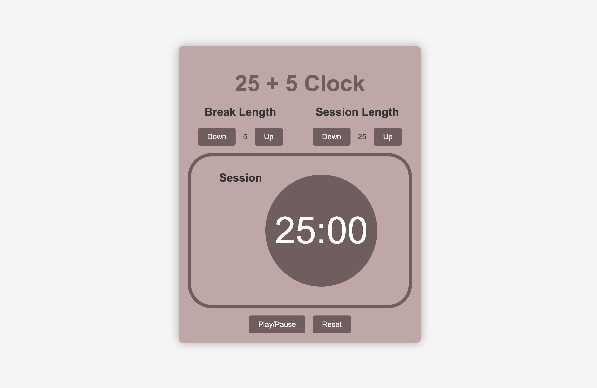

# Pomodoro Clock App

This Pomodoro clock application helps you manage your work and break sessions effectively using the popular time management technique.



## Table of Contents

- [Overview](#overview)
- [Features](#features)
- [Technologies Used](#technologies-used)
- [Installation](#installation)
- [Usage](#usage)
- [Contributing](#contributing)
- [Credits](#credits)
- [License](#license)

## Overview

The Pomodoro Clock App is a productivity tool that helps users work efficiently using the Pomodoro Technique. This technique involves working for a set period (typically 25 minutes), followed by a short break (typically 5 minutes). The cycle repeats to help maintain focus and productivity.

## Features

- **Session and Break Length Control**: Adjust the duration of work sessions (Session) and break periods (Break) to suit your preferences.
- **Countdown Timer**: Displays the remaining time for the current session or break in MM:SS format.
- **Start, Pause, and Reset**: Control buttons to start, pause/resume, and reset the timer.
- **Audio Alert**: Plays a sound alert when a session or break ends.

## Technologies Used

- **React**: Built with React for a dynamic and responsive user interface.
- **CSS**: Styled with CSS for layout and design.
- **HTML5 Audio**: Utilizes HTML5 audio for playing alert sounds.

## Installation

To run this project locally, follow these steps:

1. Clone the repository:

   ```bash
   git clone https://github.com/ductmOfficial/pomodoro-clock
   ```

2. Navigate into the project directory:

   ```bash
   cd pomodoro-clock
   ```

3. Install dependencies:

   ```bash
   yarn install
   ```

4. Start the development server:

   ```bash
   yarn start
   ```

5. Open your browser and visit `http://localhost:3000` to view the Pomodoro clock application.

## Usage

- Adjust the session and break lengths using the up/down buttons next to each timer label.
- Click the "Start" button to begin the timer.
- Click the "Pause" button to pause the timer. Click again to resume.
- Click the "Reset" button to reset both session and break lengths and stop the timer.

## Contributing

Contributions are welcome! If you have any suggestions, bug reports, or improvements, please feel free to submit a pull request. For major changes, please open an issue first to discuss what you would like to change.

1. Fork the repository.
2. Create a new branch (`git checkout -b feature-branch`).
3. Make your changes.
4. Commit your changes (`git commit -m 'Add some feature'`).
5. Push to the branch (`git push origin feature-branch`).
6. Open a pull request.

## Credits

- The audio alert sound used in this application is from [FreeCodeCamp](https://www.freecodecamp.org/).

## License

This project is licensed under the MIT License - see the [LICENSE](./LICENSE) file for details.
